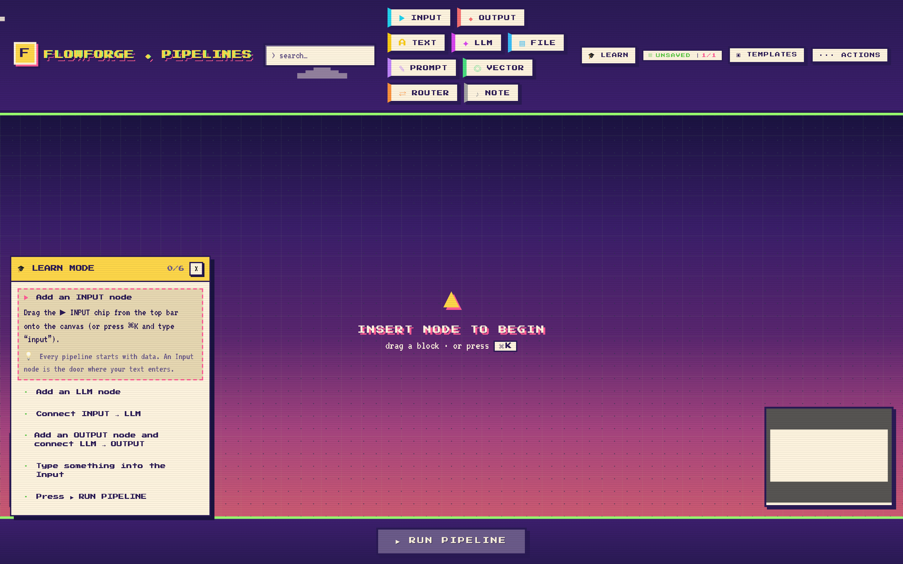
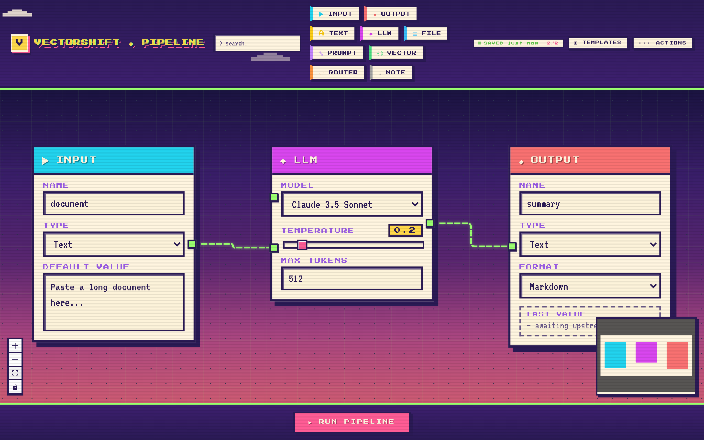
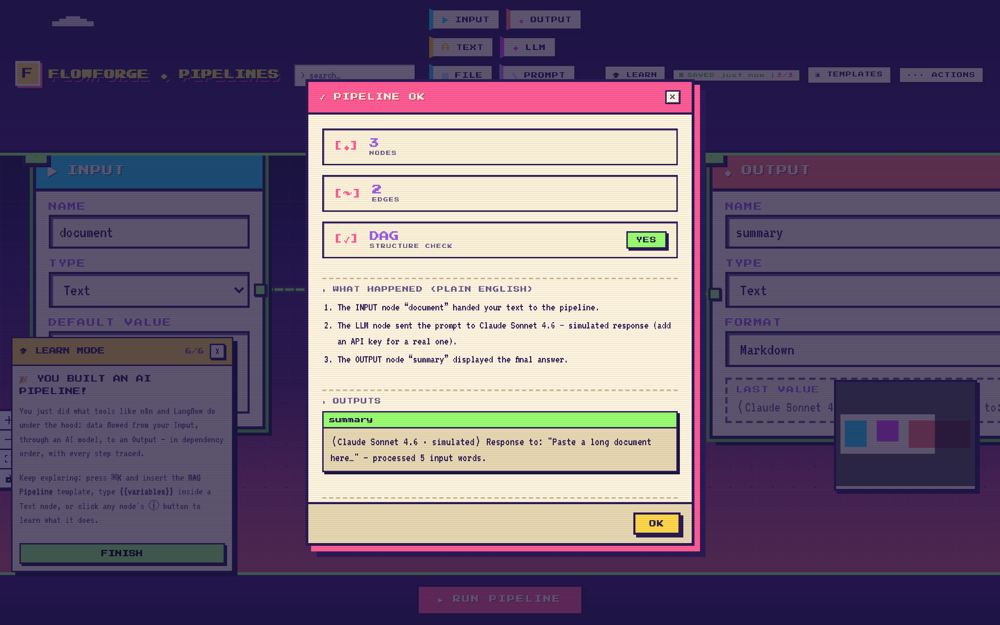
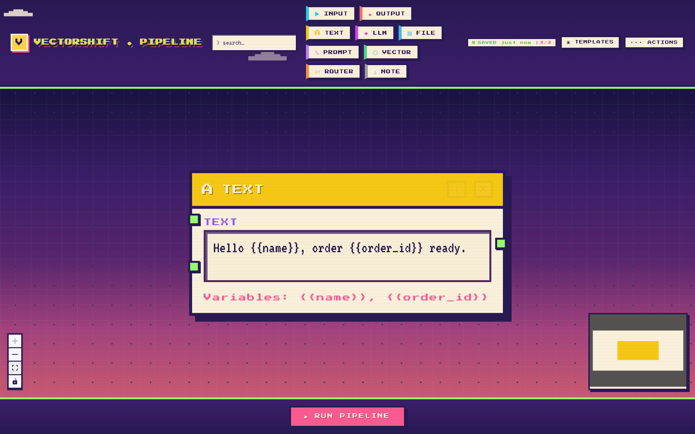
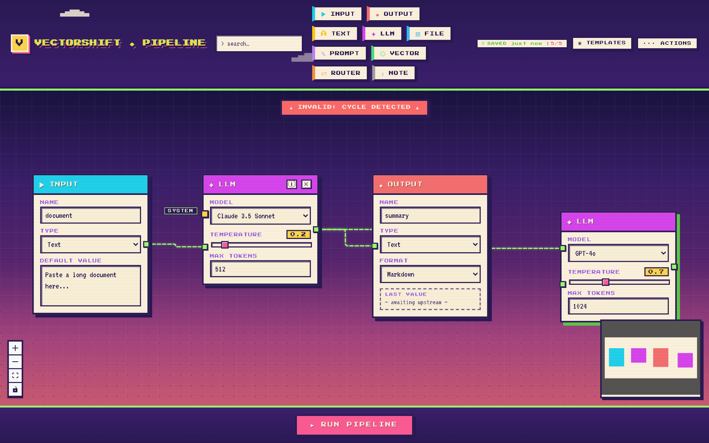

# FlowForge ◆ Visual LLM Pipelines

**🕹️ Live demo: [flowforge-sigma-eosin.vercel.app](https://flowforge-sigma-eosin.vercel.app)** — no signup, no API key needed. *(First run may take ~30s while the free-tier backend wakes up.)*

A drag-and-drop pipeline builder for LLM workflows — with **real execution**,
per-node observability, a built-in **teaching mode for complete beginners**,
and a Pixel-Arcade UI. Build a graph of nodes, wire them together, hit
**► RUN PIPELINE**, and watch data flow through it in topological order.



## Why another node-canvas app?

Most pipeline-builder demos stop at drawing the graph. FlowForge runs it:

- **Execution engine** — the backend topologically sorts the DAG and executes
  each node: inputs emit values, `{{variables}}` get substituted into text and
  prompt templates, a router evaluates its condition and skips the untaken
  branch, vector search ranks chunks, and outputs capture final results.
- **Multi-provider LLM** — the LLM node calls **OpenAI, Anthropic, or Google
  Gemini** live when an API key is set (`OPENAI_API_KEY`, `ANTHROPIC_API_KEY`,
  `GEMINI_API_KEY`). No key? A clearly-labelled deterministic simulation keeps
  every demo runnable, keyless and free.
- **Observability** — every run returns a per-node trace: status
  (executed / skipped / error), logs, timings, and outputs. Nodes animate on
  the canvas in execution order and light up green / grey / red.
- **Learns you, not the other way round** — 🎓 Learn Mode is a quest-log
  tutorial that watches the canvas and advances itself as you complete each
  step (add a node → wire it → run), teaching the concept behind each action.
  Every run also narrates itself in plain English ("The INPUT node handed
  your text to the pipeline…") before showing the technical trace.
- **Cycle-proof by construction** — invalid edges (cycles, self-loops,
  duplicate connections, occupied inputs) are rejected *while you drag them*,
  and the server re-validates with Kahn's algorithm.




## Features

| | |
|---|---|
| 🎓 Learn Mode | Auto-advancing guided tutorial — zero prior knowledge needed |
| Plain-English runs | Every execution narrated step by step, then the technical trace |
| 9 node types | Input, Output, Text, LLM, File, Prompt Template, Vector Search, Router, Note |
| Config-driven nodes | One `BaseNode` renders everything — a new node type is ~30 lines |
| Dynamic handles | Type `{{variable}}` in a Text node and an input handle appears live |
| ⌘K command palette | Add nodes and insert templates from the keyboard |
| Templates | RAG pipeline, Summarization, Classifier — one click |
| Undo / redo + autosave | Debounced history (50 steps) persisted to localStorage |
| Import / export | Pipelines round-trip as JSON |
| Auto-layout | Longest-path layered layout in 40 lines |




## Quickstart

```bash
# Terminal A — backend (FastAPI, port 8000)
cd backend
pip install -r requirements.txt
uvicorn main:app --port 8000 --reload

# Terminal B — frontend (React, port 3000)
cd frontend
npm install
npm start
```

Optional — live LLM calls:

```bash
export ANTHROPIC_API_KEY=...   # and/or OPENAI_API_KEY, GEMINI_API_KEY
```

## Tests

```bash
cd backend && pytest test_main.py -v   # 17 tests: DAG validation, execution, providers
```

## Architecture

```
┌─────────────────────────────┐        ┌──────────────────────────────┐
│  React frontend  :3000      │  HTTP  │  FastAPI backend  :8000      │
│                             │ ─────► │                              │
│  ReactFlow canvas           │  POST  │  /pipelines/parse            │
│  Zustand store (state)      │  JSON  │    → counts, DAG check       │
│  Pixel-Arcade CSS theme     │        │  /pipelines/execute          │
│                             │ ◄───── │    → run the graph           │
└─────────────────────────────┘        │  providers.py                │
                                       │    → OpenAI/Anthropic/Gemini │
                                       └──────────────────────────────┘
```

Deep dives live in [learn/](learn/) — eight documents covering the node
abstraction, state management, the variable-handle regex, the styling system,
Kahn's algorithm, the execution engine, and production practices.

## Tech

React 18 · ReactFlow 11 · Zustand 5 · FastAPI · httpx · pytest

## License

[MIT](LICENSE)
